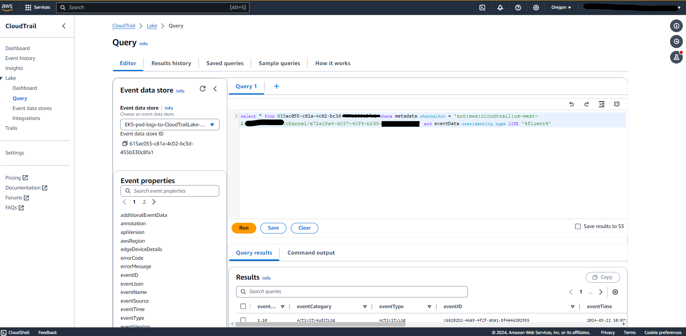

# Blog Post: cloudops-1529 - How to automate application log ingestion from Amazon EKS on Fargate into AWS CloudTrail Lake

Customers often look for options to capture and centralized storage of application logs from [Amazon Elastic Kubernetes Service on
Fargate](https://docs.aws.amazon.com/eks/latest/userguide/fargate.html)
(Amazon EKS on Fargate) Pods to investigate root causes or analyze security incidents. Customers also like the capability to
easily query the logs to assist with security investigations. In this
blog post, we show you how to ingest the Amazon EKS Pod logs into [AWS
CloudTrail
Lake](https://docs.aws.amazon.com/awscloudtrail/latest/userguide/cloudtrail-lake.html)
for long-term storage and analytics.  

AWS CloudTrail Lake is a managed audit and security Lake to aggregate,
immutable store and query activity data. In Jan 2023, AWS announced the
support of [ingestion for activity events from non-AWS sources using
CloudTrail
Lake](https://aws.amazon.com/blogs/aws/new-aws-cloudtrail-lake-supports-ingesting-activity-events-from-non-aws-sources/),
making it a single location of immutable user and API activity events
for auditing and security investigations.

This blog shows how to capture the STDOUT and STDERR input/output (I/O)
streams from your container and send them to S3 using [Fluent
Bit](https://fluentbit.io/). Then we showcase a sample serverless
application which will automatically parse and ingest the logs into AWS
CloudTrail Lake.

**Introduction**

Sending output logs to stdout and stderr is considered a best practice in Kubernetes according to the [Twelve-Factor App](https://12factor.net/) manifesto, which provides the gold standard for architecting modern applications. We see cluster level log collection systems also built using this premise.

In Kubernetes, container logs are written to the file path
/var/log/pods/\*.log on the node. Amazon EKS on Fargate offers a
[built-in log
router](https://aws.amazon.com/blogs/containers/fluent-bit-for-amazon-eks-on-aws-fargate-is-here/) -
[AWS for Fluent Bit](https://github.com/aws/aws-for-fluent-bit) based on
[Fluent Bit](https://fluentbit.io/), an upstream compliant distribution
of Fluent Bit managed by AWS. This lightweight log router allows you to
collect data and logs from Amazon EKS with filters and send them to
multiple destinations like S3, CloudWatch, Kinesis Data Firehose,
Kinesis Data Streams and Amazon OpenSearch Service.

In this blog post, we present to you how to configure Amazon EKS on
Fargate pods to deliver logs into S3. You can then, deploy the sample
serverless application which can selectively ingest the Pod logs into
AWS CloudTrail Lake.

**Solution overview**

The following diagram provides an overview of the setup for this
solution. AWS for Fluent Bit will be deployed as a Daemon Set in the
"s3-exporter" namespace and it will be configured to forward pod logs to
an S3 Bucket.

{width="6.467361111111111in" height="4.610416666666667in"}

**Steps to deploy sample solution:**

**Step 1:**

Create an S3 bucket to centralize storage of Application Logs and ensure
it has the right permissions. This S3 bucket name is required in the
subsequent steps.

**Step 2:**

Next, Deploy [AWS for Fluent
Bit](https://github.com/aws/aws-for-fluent-bit) as a Daemon Set in the
s3-exporter namespace and it will be configured to forward pod logs to
an S3 Bucket.

Use [Helm](https://helm.sh/) which is a package manager for Kubernetes,
deploy the
[aws-for-fluent-bit](https://github.com/aws/aws-for-fluent-bit) image.
Use the following YAML file to configure fluent bit while deploying.
Replace the bucketname and region with values from your AWS Account.

s3-fluentbit-values.yaml

```yaml
---
s3:
    enabled: true
    match: \"\*\"
    bucket: eks-log-fluent-bit
    region: \"us-west-2\"
    jsonDateKey: \"date\"
    jsonDateFormat: \"iso8601\"
    totalFileSize: \"100M\"
    uploadChunkSize: \"6M\"
    uploadTimeout: \"10m\"
    storeDir: \"/tmp/fluent-bit/s3\"
    storeDirLimitSize: 0
    s3KeyFormat: /pod-logs/\$TAG/%Y-%m-%d/%H-%M-%S
    s3KeyFormatTagDelimiters:
    staticFilePath: false
    usePutObject: false
    roleArn:
    endpoint:
    stsEndpoint:
    cannedAcl:
    compression:
    contentType:
    sendContentMd5: false
    autoRetryRequests: true
    logKey:
    preserveDataOrdering: true
    storageClass:
    retryLimit: 1
    externalId:
cloudWatchLogs:
    enabled: false
```
```shell
$ helm repo add eks https://aws.github.io/eks-charts

eks has been added to your repositories

$ helm upgrade fluentbit eks/aws-for-fluent-bit --install --namespace s3-exporter --create-namespace -f s3-fluentbit-values.yaml

Release "fluentbit" does not exist. Installing it now.
NAME: fluentbit
LAST DEPLOYED: Thu Mar 21 20:55:44 2024
NAMESPACE: s3-exporter
STATUS: deployed
REVISION: 1
TEST SUITE: None
NOTES:
fluentbit has been installed or updated. To check the status of pods,
run:
kubectl get pods -n s3-exporter
```

Verify that Fluent Bit is running with one pod on each of the cluster
nodes.
```shell
$ kubectl get daemonset -n s3-exporter
```
After the logging is enabled will start seeing the logs appear in the
configured S3 Bucket.

**Step 3:**

Deploy the sample solution to ingest logs into CloudTrail Lake.

1.  Install the SAM CLI. (The Serverless Application Model Command Line
    Interface (SAM CLI) is an extension of the AWS CLI that adds
    functionality for building and testing Lambda applications.)

2.  Install Python 3.12

3.  Download the solution

```shell
$ git clone git@ssh.gitlab.aws.dev:cca-ambassadors/Amazon-EKS-pod-logs-to-CloudTrail-Lake.git
```
4.  Build and deploy the solution. Note that, this solution automatically deploys AWS resources required. You will be billed for the AWS resources used by this solution.

```shell
$ cd EKS-pod-logs-to-CloudTrailLake

$ sam build

$ sam deploy --guided --capabilities CAPABILITY_NAMED_IAM
```
Provide the following as input when you run the command:

1.  Stack Name: Provide any name here for e.g.
    EKS-pod-logs-to-CloudTrailLake

2.  AWS Region: e.g: us-west-2

3.  Parameters:

    -   LogImportFrequency-- This parameter defines how often the lambda
        function executes the import function. The allowed Values are
        "rate(1 day)", "rate(12 hours)", "rate(6 hours)", "rate(3
        hours)", and "rate(1 hour)".

    -   EKSPodNames -- A comma-delimited list of EKS Pod Names to export
        Pod Logs from. Eg. UI,DB

    -   EKSS3LogLocation - S3 bucket name where exported EKS Pod Logs
        reside. E.g. eks-log-fluent-bit

4.  Confirm changes before deploy: If set to yes, then any change sets
    will be shown to you for manual review before execution. If set to
    no, then the AWS SAM CLI will automatically deploy application
    changes.

5.  Allow SAM CLI IAM role creation: To deploy this application's AWS
    CloudFormation stack, which creates or modifies IAM roles, the
    CAPABILITY_IAM value for capabilities must be provided. If the
    permission isn't provided through this prompt, then in order to
    deploy this example you must explicitly pass --capabilities
    CAPABILITY_IAM to the sam deploy command.

6.  Save arguments to samconfig.toml: If set to yes, then your choices
    will be saved to a configuration file inside the project. This is so
    that in the future you can just re-run sam deploy without parameters
    in order to deploy changes to your application.

After the solution is deployed you will notice that the logs from S3 are
ingested into a AWS CloudTrail Lake data store that was configured as
part of this solution.

The solution automatically moves the log files ingested into AWS
CloudTrail Lake to a directory called "backup_pod-logs" within the same
S3 bucket. You choose a cost effective [storage
class](https://docs.aws.amazon.com/AmazonS3/latest/userguide/storage-class-intro.html)
for this "backup_pod-logs" directory, depending on your use case
scenario.

**Viewing the EKS application logs in CloudTrail Lake**

You can run SQL-based queries against the Pod logs. You can filter on PodNames using the LIKE filter as shown below.
```sql
select * from 615ac055-c81a-4c02-bc3d-455b330c8fa1 where metadata.channelArn = 'arn:aws:cloudtrail:us-west-2:123456768901:channel/e72a18a4-d037-40f4-b298- 4896b65454d1' and eventData.useridentity.type LIKE '%fluent%'
```
{width="6.5in" height="3.095833333333333in"}


**Clean up**

1.	Delete the EKS-pod-logs-to-CloudTrailLake application that you created:

```shell
$ sam delete
```
2.	To uninstall/delete the aws-for-fluent-bit release:

```shell
$ helm delete aws-for-fluent-bit --namespace s3-exporter
```

**Conclusion**

In this blog post, we showcased how to use AWS CloudTrail Lake as the centralized location to immutably store containerized workload’s application logs as activity events. We then showed you to run SQL-based queries within CloudTrail Lake for audit, security, and operational purposes
